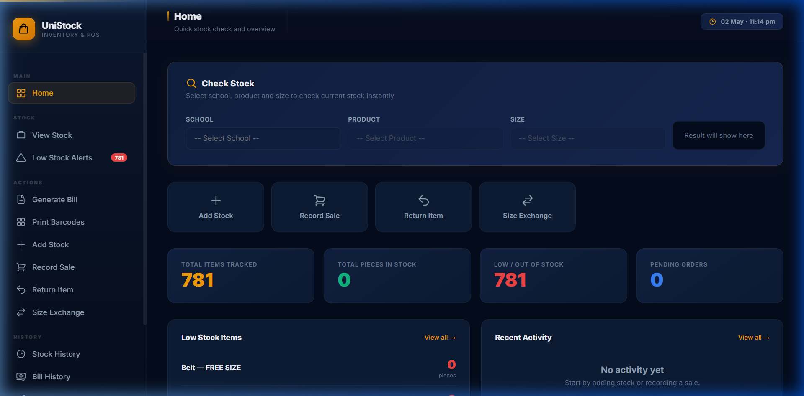
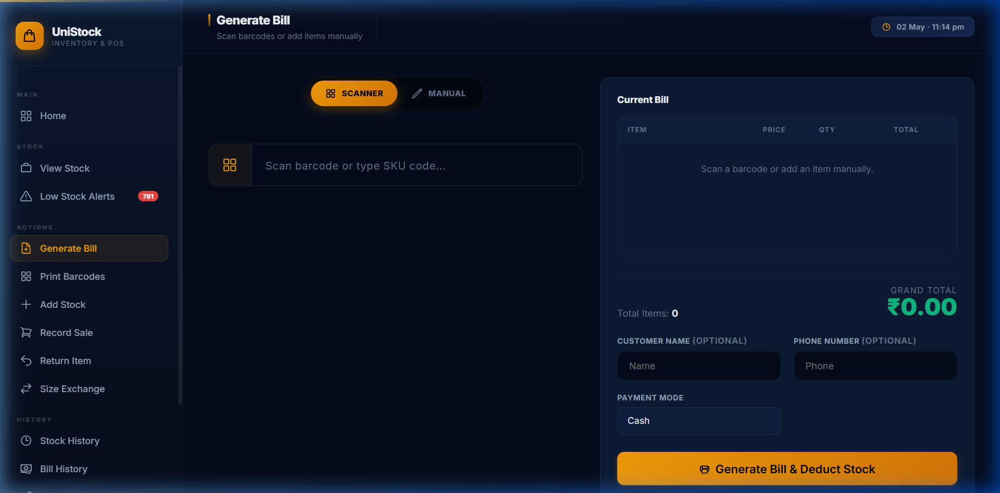
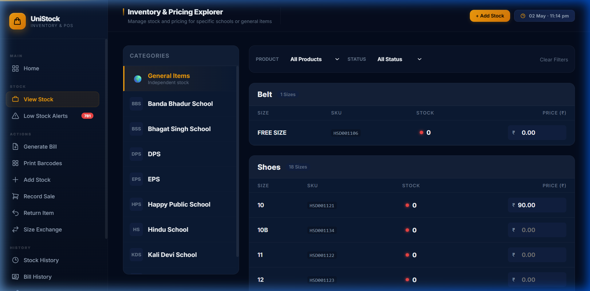
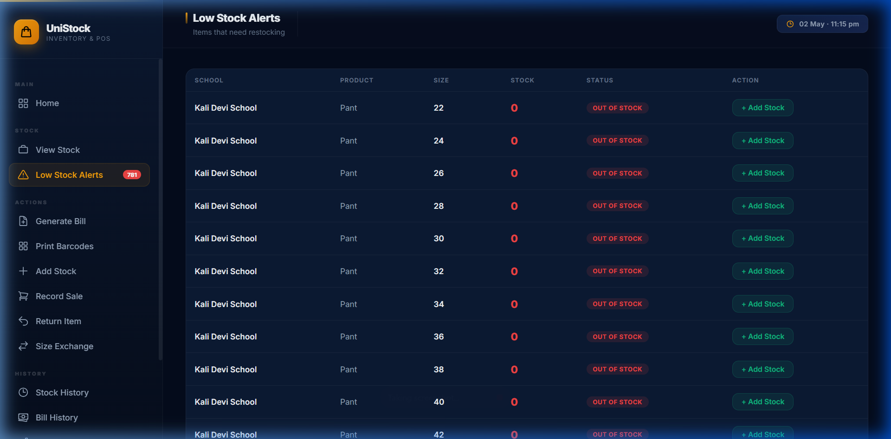

# 👕 Uniform Inventory Management System

A professional Django-based inventory management system designed to streamline the tracking and management of school uniforms. This application features a premium, modern UI with dark mode, real-time stock tracking, and a fast POS billing interface.

---

## 📸 Preview

<div align="center">
  <h3>Modern Dashboard</h3>
  
  
  <p align="center">
    
    
  </p>
  
  <h3>Real-time Alerts</h3>
  
</div>

---

## 🚀 Features

-   **🏫 School Management**: Maintain a database of schools with unique codes.
-   **📦 Product Catalog**: Manage different types of uniform items (e.g., Shirts, Trousers, Blazers).
-   **📏 Size Tracking**: Define available sizes for each specific product.
-   **📊 Inventory & Pricing**: Track stock levels and set custom prices for each product-size combination per school.
-   **🛠 Admin Dashboard**: Full-featured Django admin interface for easy data management.

---

## 🛠 Tech Stack

-   **Framework**: [Django](https://www.djangoproject.com/)
-   **Database**: SQLite (Default)
-   **Language**: Python 3.x

---

## 📋 Prerequisites

Ensure you have Python 3.x installed on your system.

---

## ⚙️ Installation & Setup

1.  **Clone the Repository**
    ```bash
    git clone https://github.com/Sushantpopli/UNIFORM_INVENTORY.git
    cd UNIFORM_INVENTORY
    ```

2.  **Create a Virtual Environment** (Optional but recommended)
    ```bash
    python -m venv venv
    # On Windows:
    venv\Scripts\activate
    # On macOS/Linux:
    source venv/bin/activate
    ```

3.  **Install Dependencies**
    ```bash
    pip install -r requirements.txt
    ```

4.  **Run Migrations**
    ```bash
    python manage.py migrate
    ```

5.  **Create a Superuser** (To access the admin panel)
    ```bash
    python manage.py createsuperuser
    ```

6.  **Start the Development Server**
    ```bash
    python manage.py runserver
    ```
    Visit `http://127.0.0.1:8000/admin` to start managing your inventory!

---

## 📂 Project Structure

```text
├── products/          # Product definitions and models
├── schools/           # School and inventory (SchoolProduct) logic
├── sizes/             # Size management per product
├── uniform_project/   # Core settings and configuration
├── manage.py          # Django management script
└── requirements.txt   # Project dependencies
```

---

## 🤝 Contributing

Contributions are welcome! Feel free to open an issue or submit a pull request.

---

## 📄 License

This project is licensed under the MIT License.

---

**Developed by [Sushant Popli](https://github.com/Sushantpopli)**
